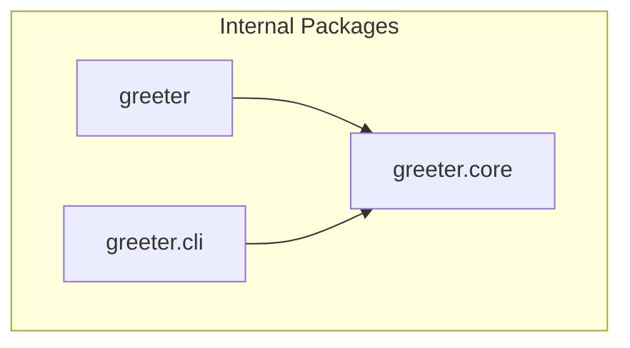

<!-- GENERATED by context-crafter-mcp v0.5.0. Do not edit manually unless you intend to overwrite generated output. -->

- **Generated by**: context-crafter-mcp v0.5.0
- **Generated at**: 2026-06-02T10:36:03.254073+00:00
- **Source repo**: demo-repo
- **Profile**: standard
- **Scanner**: max_files=800, max_depth=5, max_file_bytes=5000000

# Dependency Graph: demo-repo

## Graph

## External Dependencies

_No external dependencies identified._

---
*Generated by context-crafter-mcp.*

