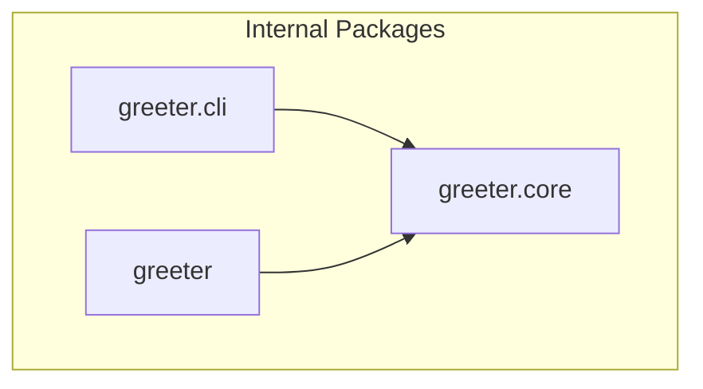

<!-- GENERATED by context-crafter-mcp v0.4.0. Do not edit manually unless you intend to overwrite generated output. -->

# Dependency Graph: demo-repo

- **Generated**: 2026-05-29T13:29:35.001210+00:00

## Graph

## External Dependencies

_No external dependencies identified._

---
*Generated by context-crafter-mcp.*

