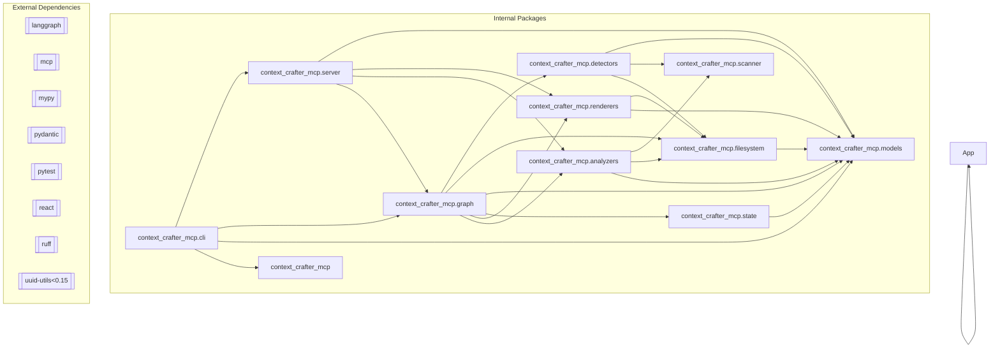

<!-- GENERATED by context-crafter-mcp. Do not edit manually unless you intend to overwrite generated output. -->

# Dependency Graph: context-crafter-mcp

- **Generated**: 2026-05-29T02:55:32.061823+00:00

## Graph

## External Dependencies

- langgraph
- mcp
- mypy
- pydantic
- pytest
- react
- ruff
- uuid-utils<0.15

---
*Generated by context-crafter-mcp.*

