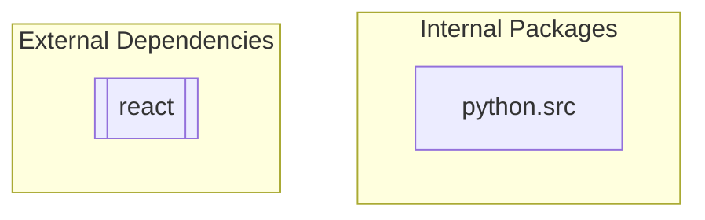

<!-- GENERATED by context-crafter-mcp. Do not edit manually unless you intend to overwrite generated output. -->

# Dependency Graph: mixed_monorepo

- **Generated**: 2026-05-29T03:10:11.306580+00:00

## Graph

## External Dependencies

- react

---
*Generated by context-crafter-mcp.*

